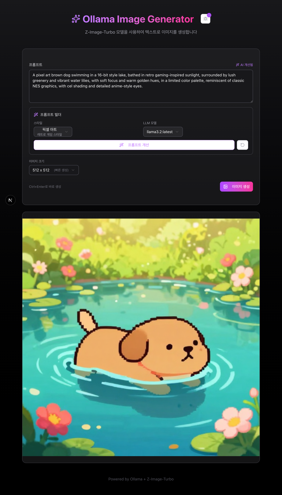

# Ollama Image Generator

Z-Image-Turbo 모델을 사용하여 텍스트로 이미지를 생성하는 웹 애플리케이션입니다.



## 기능

- **이미지 생성**: 프롬프트를 입력하여 AI 이미지 생성
- **프롬프트 빌더**: LLM 모델을 사용하여 프롬프트 자동 개선
- **스타일 프리셋**: 사실적, 애니메이션, 유화, 수채화, 3D 렌더, 픽셀 아트, 사이버펑크 등 11가지 스타일
- **이미지 크기**: 512x512, 768x768, 1024x1024 선택 가능
- **디버그 콘솔**: API 요청/응답 실시간 로그 확인
- **다운로드**: 생성된 이미지 PNG 파일로 저장

## 요구 사항

- Node.js 18+
- [Ollama](https://ollama.ai) v0.14.0+
- Z-Image-Turbo 모델 설치

```bash
ollama pull x/z-image-turbo
```

## 설치

```bash
pnpm install
```

## 실행

```bash
pnpm dev
```

http://localhost:3000 으로 접속

## 기술 스택

- Next.js 16
- React 19
- Tailwind CSS
- ShadCN UI
- Ollama API

## API 엔드포인트

| 엔드포인트 | 설명 |
|-----------|------|
| `POST /api/generate` | 이미지 생성 (SSE 스트리밍) |
| `POST /api/enhance` | 프롬프트 개선 |
| `GET /api/models` | 설치된 LLM 모델 목록 |

## 환경 변수

```env
OLLAMA_URL=http://localhost:11434
```
